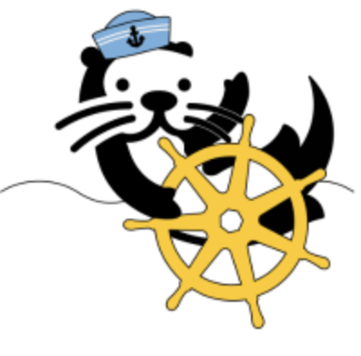

# Otterize OSS




[About](#about) | [Quick tutorials](https://docs.otterize.com/quick-tutorials/) | [Docs](https://docs.otterize.com) | [Contributing](#contributing) | [Slack](#slack)

## About
Otterize OSS is an open source project for easily managing service-to-service authorization in a Kubernetes cluster, by declaring with [client intents files](https://otterize.com/ibac) the calls each service needs to make. The main component of Otterize OSS &mdash; the Otterize intents operator &mdash; uses these files to configure network policies, Kafka ACLs, and other enforcement points (in the future) so they allow just the intended calls. 

[Otterize OSS](https://otterize.com/oss) is developed by [Otterize](https://otterize.com) as a standalone implementation of [intent-based access control (IBAC)](https://otterize.com/ibac) for a single Kubernetes cluster. It does not depend on the upcoming [Otterize Cloud](https://otterize.com/product).

### Intent-based access control (IBAC)

Here is an example of an intents file, as a Kubernetes custom resource YAML, for a service called **"checkoutservice"** which intends to call **"ecomm-events"** (a Kafka cluster) and **"shippingervice"** (an HTTP server):
```yaml
apiVersion: k8s.otterize.com/v1
kind: ClientIntents
metadata:
  name: checkoutservice
  namespace: production
spec:
  service:
    name: checkoutservice
  calls:
    - name: ecomm-events
      type: kafka
      topics: 
        - name: orders
          operations: [ produce ]
    - name: shippingservice
      type: http
      resources:
      - path: /shipments
        methods: [ get, post ]
```
In this example the developers of **"checkoutservice"** chose to declare more granular information about the calls they'll make, allowing tighter enforcement of authorization.

Developers create and maintain such an intents file for each service alongside its code. The intents are expressed in terms familiar to developers &mdash; services accessing services, not pod labels and such &mdash; without worrying about how access is controlled. 
With this [intent-based access control](https://otterize.com/ibac) approach, you can implement a zero-trust Kubernetes cluster with minimal developer friction.

### Bootstrapping intents files

To bootstrap client intents files for the services running in your cluster, you can use the [Otterize network mapper](https://github.com/otterize/network-mapper) to automatically detect pod-to-pod calls in your cluster and build a network map. The map can be exported as a set of client intents files. Developers can then evolve the intents files as their needs evolve, and the authorization that occurs when they're applied to the cluster will then evolve with them, so access is always minimized to what's needed.

### Credentials

If credentials such as X509 certificates are needed for authentication and authorization &mdash; for example, to connect to Kafka with mTLS &mdash; the intents operator works with SPIRE and the [Otterize SPIRE integration operator](https://github.com/otterize/spire-integration-operator) to automatically establish pod service identities, generate trusted credentials for each client service, and deliver them to the pod in a locally-mounted volume.


## Contributing
1. Feel free to fork and open a pull request! Include tests and document your code in [Godoc style](https://go.dev/blog/godoc)
2. In your pull request, please refer to an existing issue or open a new one.

## Slack

To join the conversation, ask questions, and advance the thinking on IBAC, please [join the Otterize Slack!](https://joinslack.otterize.com)
